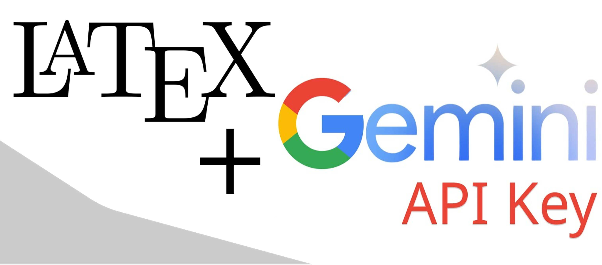

# LaTeXGPT: AI-assisted LaTeX-based Resume Creation

## Introduction

LaTeX, pronounced “Lay-tech”, is a free, high-quality typesetting system designed for the production of technical and scientific documentation. It has become the de facto standard for communication and publication of scientific documents [2]. The speciality of LaTeX is how it provides a code-based approach towards documentation, allowing users to focus on the content of their documents rather than worry about the specific font sizes, styles and formatting.

One such use-case is the creation of student resumes – students may often find themselves updating and maintaining multiple documents at the same time, all of which may be incompatible with each other, contending with the formatting limitations of their choice of word processor (.DOC, .DOCX, .PDF, etc). While Google Docs have become the universal solution for text-based document sharing across multiple users, their functionality is heavily constrained when users need to include specially formatted text, mathematical symbols, or images within their documents. LaTeX seeks to address this gap specifically, offering control over large documents with sectioning, cross-references, tables and figures in a much more accessible fashion for students with adequate code literacy.

This project seeks to bridge the gap between users who are familiar with developing resumes and those who are fluent in LaTeX by employing the use of AI in resume creation and editing, and finally allowing the user to extract their enhanced resumes in LaTeX format to open using online LaTeX editors such as Overleaf or locally installed packages like MikTeX. Gemini’s 2.5 Flash model allows for quick PDF parsing and LaTeX generation/editing in tandem with the user’s preferences, allowing students to efficiently obtain a general use resume which they can easily tailor before submission.

## Methods/Instructions

### 1. Accessibility

The overall coverage and accessibility of the website extends to anyone with internet access and the means to loosely collect their experiences in a document for submission. The resume upload section allows users to drag-and-drop a file or browse their file directory for a suitable resume to upload. .TXT, .PDF, and .DOCX formats are supported, but .PDF format is encouraged as it is likely that a student would have PDF versions of their past resumes. Files are securely processed and deleted upon page refresh, meaning that users are not at harm of having their data stolen.

### 2. Communication

Once any resume is uploaded, Gemini is called to return a summary of the user’s resume and some suggestions on how to improve it. The user can continuously talk to the chatbot and ask it to integrate further improvements as per their preferences. Since this step is handled using only AI with a limited scope of memory (up to 10 pairs of user requests), results may vary over longer conversations.

### 3. Automatic Updates

While the user talks with their chatbot, a formatted LaTeX file is continuously integrated with the changes they want and is available for download at any time. This file is also updated by Gemini, which keeps the original resume content in mind to ensure new content does not deviate from the user’s expectations.

### 4. Downloads/Exporting

Users may either download the LaTeX file to open on their own systems using pdflatex, or directly copy its contents to their clipboard and paste it within Overleaf or CriXet to see how it would look. Buttons are provided which open both.

### 5. Deployment/Updates

LaTeXGPT is hosted via duckdns.org, a free service which points a DNS to a target IP. The persistent server running this project is hosted via a VM powered by Google Cloud Console. It uses code hosted on Github that can be found here. In theory, this VM should run indefinitely, keeping the website hosted. In case the server goes down or there is an outage, the VM is configured to automatically start the website whenever it starts up again.

## Results and Ethics

This project successfully lets the user upload their resume, chat with a Gemini chatbot to improve it, and extract a professionally LaTeX-formatted resume that they can use either on Overleaf or via pdflatex. The webpage can be found here: [LaTeXGPT](https://latexgpt.duckdns.org/)

On the topic of ethics, there are many avenues where this project can be exploited:-

### 1. Indirect Prompt Injection

Since this project requires the user to upload a resume, they can take advantage of that to upload a PDF, DOCX, or text file with hidden white-text instructions to make the AI ignore its previous instructions and execute malicious instructions on the server-side. The project relies on Gemini’s own resistance to such injection attacks to defend itself, but we do not store any user data from past iterations that could be a target for such an attack.

### 2. AI Jailbreaking

Because this project uses Gemini API calls and lets the user interact with the AI, there is a potential for the user to jailbreak the AI to perform unintended tasks. To mitigate the effectiveness of jailbreaking attempts, there is first a rate limit imposed on the Gemini API model to prevent overwhelming the AI. Additionally, every message sent by the user is surrounded by context that guides the API to act under the pretext of being a resume editing expert and not engage in unrelated tasks.

### 3. Denial of Service/Wallet

Because every resume upload and message from the user is associated with an API call to Gemini, attackers may use this feature to flood the backend with multiple large files or complex prompts, causing the API Key’s free-tier credits to run out, be rate-limited, or crash, hence denying service to legitimate users via fatigue.

Future recommendations for this project include:-

### 1.Native LaTeX preview: Show users what their LaTeX resume looks like while editing

### 2. Additional generation options: More document types (abstracts/research papers)

### 3. Additional prompt security: Backend sanitation to mitigate jailbreak attempts

### 4. User accounts/database: Allow the user to login and save progress on prior documents
